# Introduction to Django - HSI Sandbox

Repositori ini sebagai dokumentasi progress pembelajaran melalui materi (Introduction to Django)[https://www.youtube.com/watch?v=rHux0gMZ3Eg]

## Creating Your First Django Project

Bagian ini menjelaskan bagaimana menginisiasi _scaffolding_ server menggunakan Django. Tahap ini membutuhkan pengguna untuk telah menginstall Python (pemateri menyatakan supaya menggunakan versi terbaru). Di tahap ini pemateri menyarankan agar menggunakan editor VS Code supaya mampu mengikuti materi yang akan disampaikan.

Untuk membuat _web server_ dengan Django, langkah berikut ini perlu dijalankan:
1. _Install_ `pipenv` dengan `pip install pipenv`
2. Buat direktori untuk menampung _source code web server_. Selanjutnya direktori ini akan disebut dengan _base directory_
3. _Install_ `django` untuk virtual environment di _base directory_ dengan menjalankan `pipenv install django` di _base directory_
    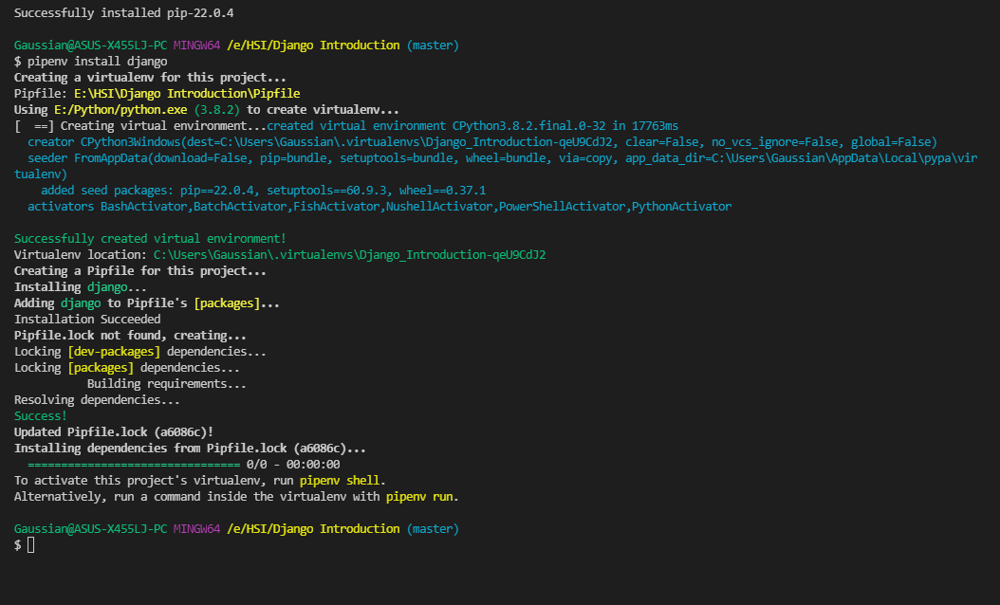

4. Untuk selanjutnya, versi python yang digunakan untuk pengembangan _web server_ adalah versi yang tersimpan di virtual environment (venv) yang telah dibuat. Selanjutnya, versi python ini akan disebut dengan _versi lokal_. Di VS Code, ini bisa dilakukan dengan men-_setting_ Python Interpreter yang digunakan dengan versi yang tersimpan di venv. Caranya dengan membuka _command palette_ dan pilih `Python: Select Interpreter` kemudian mengisi/memilih versi Python di direktori venv. Apabila tidak menggunakan VS Code (atau memilih untuk tidak menggunakan fitur dari VS Code), hal ini bisa dilakukan dengan menjalankan `pipenv shell` di _base directory_.
5. Pastikan Django telah terinstall dengan menjalankan `django-admin`
6. Buat _scaffolding_ server di _base directory_ dengan menjalankan `django-admin startproject <nama project> <base directory>`. Misalkan, `django-admin startproject storefront .` Apabila langkah ini dijalankan dengan benar, sebuah file bernama _manage.py_ dan folder bernama sesuai dengan nama project yang dientrikan akan muncul di _base directory_. File _manage.py_ berisi _command_ yang sama dengan `django-admin` dan beberapa _command_ lainnya
7. Pastikan semua berjalan dengan baik dengan menjalankan `python manage.py runserver [<port>]`. Secara default `port` akan bernilai 8000. Setelah menjalankan command tersebut, buka browser ke alamat `127.0.0.1:8000`. Jika semua proses berjalan dengan benar, sebuah laman yang mengatakan instalasi Django telah berhasil akan muncul
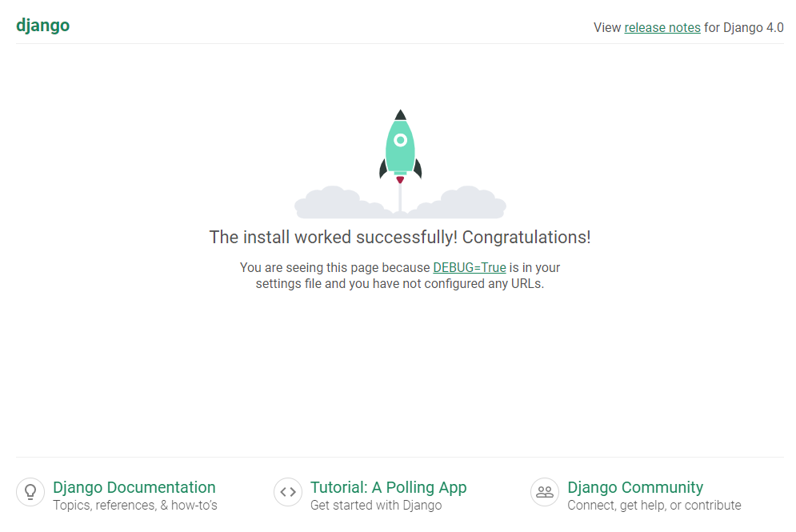

## Creating Your First App - Writing Views

Django dibangun di atas _app_. Setiap _app_ menyajikan sebuah fungsionalitas yang spesifik. Sebuah project Django bisa memiliki banyak _app_.

Untuk menginisiasi sebuah app baru, jalankan command `python manage.py appstart <nama app>`. Sebuah direktori baru akan dibuat yang bernama `<nama app>`. Direktori ini adalah sebuah modul dengan struktur berikut.

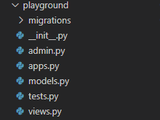

Direktori ini berisikan hal berikut:
1. Folder _migrations_, berfungsi untuk men-setup database
2. File \_\_init\_\_.py, digunakan sebagai penanda untuk Python bahwa direktori ini adalah sebuah modul
3. File admin.py, digunakan untuk mengatur interface administrator dari app tersebut
4. File apps.py, berfungsi sebagai pusat konfigurasi app
5. File models.py, berisi definisi struktur data (i.e. model dalam MVC) dalam bentuk class
6. File tests.py, berisi unit test untuk app tersebut
7. File views.py, berisi bagaimana app digunakan untuk memberikan respon atas request yang datang

"View" pada framework Django tidak sama dengan "view" pada konsep arsitektur sistem pada umumnya (e.g. MVC, MVVM). "View" pada framework Django lebih tepat disebut dengan "Response Handler", sedangkan "view" pada konsep arsitektur pada umumnya adalah sebuah interface yang dapat dilihat oleh pengguna.

View dibuat dengan mendefinisikan sebuah fungsi pada file _views.py_. Fungsi ini akan me-return response yang akan dikirim ke client. Salah satu nilai yang bisa digunakan sebagai nilai return fungsi view adalah class `django.http.HttpResponse`

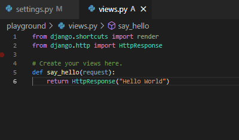

# Mapping URLS to Views

Sebelumnya telah dijelaskan bahwa _views_ di Django merupakan response handler. _View_ yang sudah dibuat tidak langsung bisa digunakan oleh Django. Agar sebuah _view_ bisa digunakan oleh Django, _view_ tersebut harus "dipasangkan" terlebih dahulu.

Ada beberapa cara yang bisa digunakan untuk memasang _view_. Salah satunya dengan membuat _URLconf_. _URLconf_ adalah file yang berisi konfigurasi endpoint yang bisa diterima beserta bagaimana response yang akan diberikan ketika endpoint tersebut diakses. File ini tidak memiliki aturan khusus terkait dengan namanya, namun konvensi umum yang digunakan adalah menamakan file ini dengan `urls.py`. Isi _URLconf_ adalah sebuah list bernama `urlpatterns` (_case-sensitive_). Isi list ini adalah instance class `django.urls.URLPattern`. Instance class tersebut dibuat dengan memanggil fungsi `django.urls.path`. Fungsi `django.urls.path` menerima beberapa parameter, namun dua yang diperlukan adalah berikut ini.

1. `route`, string. Route endpoint yang dimaksud. Ex: `"page/about/contact"`
2. `view`, function. `view` harus mengembalikan object yang merupakan turunan dari class `django.http.response.HttpResponseBase`, seperti `django.http.response.HttpResponse` atau `django.http.response.StreamingHttpResponse`. Artinya class turunan dari kedua class ini juga bisa digunakan sebagai return value function yang digunakan untuk `view`

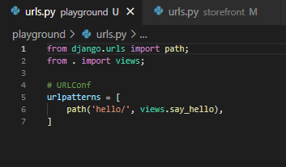

Setelah file _URLconf_ dibuat, file ini dihubungkan melalui _URLconf_ utama: file `urls.py` di dalam direktori dengan nama project yang dibuat. Cara menghubungkan file _URLconf_ app ke _URLconf_ utama hampir sama dengan mendefinisikan route endpoint yang telah dijelaskan sebelumnya. Yang membedakan adalah pada parameter `view` di dalam fungsi `django.urls.path`, fungsi `django.http.include` digunakan. Fungsi `django.http.include` menerima string yang berisi path ke _URLconf_ app. _Directory separator_ yang digunakan pada path tersebut adalah tanda titik (`.`) dan bukan (back)slash.

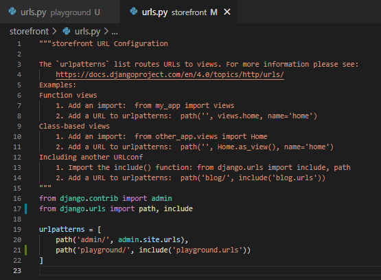

Request datang dengan route, yaitu dari endpoint mana request diterima. Ketika request datang, _URLconf_ di-resolve secara bertahap untuk menyusun response request tersebut dimulai dari route segment paling depan. _URLconf_ app akan di-resolve ketika request datang melalui endpoint yang meng-`include` _URLconf_ tersebut. Misalnya jika pengguna mengakses route `restaurant/order`, maka bagian _URLconf_ yang akan bekerja adalah sebagai berikut:
```python
# main URLconf
urlpatterns = [
    ...
    path('restaurant', include('restaurant.urls')),
    ...
]
```
Lalu di file _restaurant/urls.py_ adalah sebagai berikut:
```python
# restaurant URLconf
urlpatterns = [
    ...
    path('order', views.make_order),
    ...
]
```

Untuk menguji bahwa _URLconf_ yang dibuat telah berfungsi dengan benar, akses route yang telah dibuat.

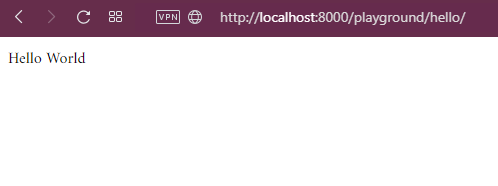

# Using Template

Di Django, _template_ adalah sebutan untuk _view_ pada hierarki MVC dan sejenisnya. File-file _template_ diletakkan pada direktori bernama `templates`.

File _template_ dapat digunakan untuk memberikan response atas sebuah request dengan menggunakan fungsi `django.shortcuts.render`. Fungsi ini menerima setidaknya dua parameter:
1. `request`, object HttpRequest
2. `template_name`, string atau `Sequence` _of string_, berisi nama file yang ada di dalam direktori `templates`

Fungsi `render` mengembalikan `django.http.response.HttpResponse`, sehingga keluaran fungsi ini bisa langsung di-return.

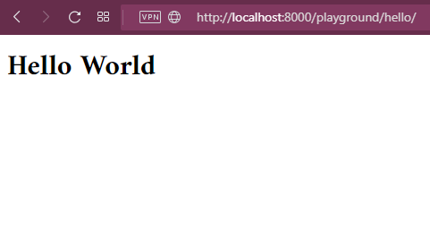

Parameter ketiga dari fungsi `django.shortcuts.render` yaitu `context`, sebuah nilai yang memetakan sebuah string ke nilai apapun. `context` bisa menggunakan `dictionary` sebagai media pemetaan. Nilai `context` akan bisa diakses oleh _template_ dengan menggunakan double curly braces i.e. `{{ ... }}`, dimana isi kurung ini adalah key `dictionary` yang dikirimkan melalui fungsi `django.shortcuts.render`

_View_ berikut ini,

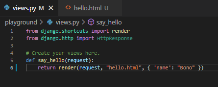

dengan _template_ ini,

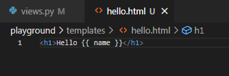

akan menghasilkan,

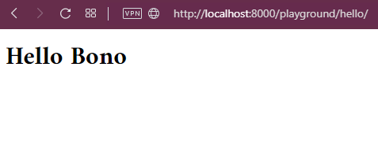

_Template_ juga bisa menerima conditional menggunakan sintaks ``. Contohnya,

```python

<h1>Hello {{ name }}</h1>

<h1>Hello World</h1>

```

# Debugging Django using VSCode

VS Code memiliki fitur debugging yang terintegrasi dengan editor. VS Code tidak hanya mampu men-debug program Python. VS Code juga bisa men-debug program Django secara khusus.

Debugging project Django menggunakan VS Code dilakukan dengan men-setup script untuk debugging. Buka salah satu file python project Django, dan fokuskan kepada file tersebut. Buka tab "Run and Debug", dan klik opsi "create a launch.json file". Kemudian akan muncul beberapa pilihan konfigurasi untuk debugging. Pilih konfigurasi "Django". Setelah memilih, akan dibuatkan file `.vscode/launch.json` dari _base directory_ project yang berisi opsi-opsi mode debugging yang dipilih. Di keypair `args` bisa ditambahkan satu string setelah nilai `"runserver"` untuk menentukan port yang digunakan agar tidak conflict dengan server yang berjalan secara non-debug.

Untuk melakukan debug, pilih pilihan "Start Debugging", baik melalui menu "Run" di toolbar atau melalui tab "Run and Debug" atau dengan shortcut `F5`. VS Code mampu me-register breakpoint seperti IDE umumnya. Caranya dengan mengklik lingkaran merah yang muncul ketika mouse meng-hover line number di editor.

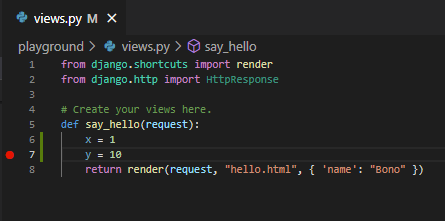

Nilai variabel pada context code yang dijalankan akan ter-register di tab "Run and Debug" dropdown "Variables". Apabila ingin melihat variabel lain, bisa digunakan dropdown "Watch" dengan memilih "Add Expression" kemudian masukkan nama variabel yang diinginkan.

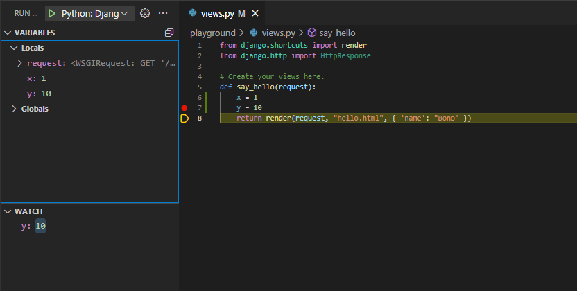

# Using Django Debug Toolbar

Terdapat package Django untuk memudahkan melakukan debugging bernama `django-debug-toolbar`. Package ini memunculkan sebuah toolbar dalam bentuk HTML yang memberikan informasi mengenai request yang datang dan bagaimana request diproses menjadi response.

Langkah untuk mulai menggunakan `django-debug-toolbar` telah tersedia di (dokumentasi resmi package tersebut)[https://django-debug-toolbar.readthedocs.io/en/latest/installation.html]. Sederhananya, instalasi dilakukan dengan cara berikut ini.

1. Install menggunakan `pip` (jika sudah menggunakan Python Interpreter di venv project) atau `pipenv` (jika belum menggunakan Python Interpreter di venv project). Gunakan command `pip install django-debug-toolbar` (ganti `pip` dengan `pipenv` sesuai kebutuhan)
2. Lakukan setup package di `settings.py` project. Hal yang perlu di-setup yaitu:
    1. Memasukkan `'debug_toolbar'` ke dalam variabel `INSTALLED_APPS`
    2. Memasukkan `'debug_toolbar.middleware.DebugToolbarMiddleware'` ke dalam variabel `MIDDLEWARE`. Posisikan nilai ini se-awal mungkin, tapi jangan posisikan sebelum middleware yang memodifikasi konten response seperti `GZipMiddleware`
    3. Memasukkan IP yang digunakan untuk mengakses project ke variabel `INTERNAL_IPS`. Umumnya variabel ini belum ada di dalam file, sehingga cukup mendefinisikan variabel tersebut sebagai sebuah list yang berisi IP yang digunakan
3. Lakukan setup package di _URLconf_ utama dengan meng-include `debug_toolbar.urls` ke route `__debug__/`

Setelah semua langkah selesai, verifikasi bahwa instalasi berhasil dengan mengakses salah satu endpoint non-`__debug__` yang telah di-setup. Pastikan bahwa _template_ yang digunakan memiliki tag `<body>` agar toolbar muncul. Pastikan juga fungsi toolbar berfungsi dengan memilih salah satu menu toolbar, dan tampilan tidak mengeluarkan pesan "Failed to fetch"

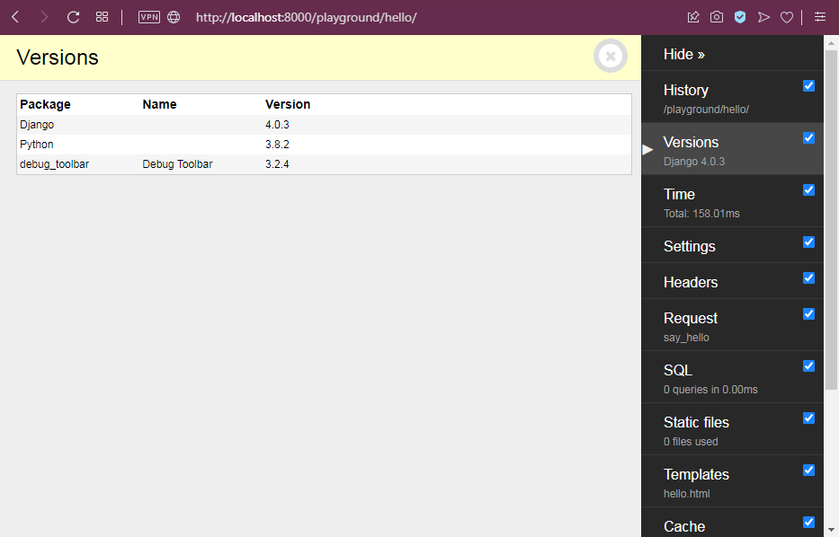